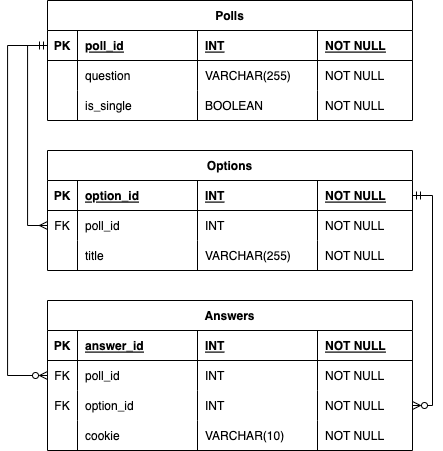

# 🌐 Worldthoughts API

A simple and friendly real-time polling application.

- Users can discover random polls by pressing the "random question" button and vote on each.
- Afterwards, results will be displayed to the user and update in real-time.
- Pressing the "resubmit" button will allow the user to change their vote.
- Users can go to the *create* page and submit their own questions to the site.

[Check out Worldthoughts **client** here!](https://github.com/melaniietong/worldthoughts)

Created as part of my application for IGN's Code Foo 10. Read my introduction [here](https://github.com/melaniietong/worldthoughts/blob/main/responses/introduction.md) and my response to the Voltorb prompt [here](https://github.com/melaniietong/worldthoughts/blob/main/responses/voltorb.md).

## Dependencies
- Express
- Cors
- Pg (PostgreSQL)
- Socket.io

## Setup

```diff
! ⚠️ Please setup this API first before the client ⚠️
``` 

1. Install Node.js, npm, and PostgreSQL.
2. Download the project.

Setting up the database:

3. In your terminal, enter into PostgreSQL. Typically with the command `psql -U postgres` and enter your PostgreSQL password.
4. Once in, enter the command `CREATE DATABASE worldthoughts;` from the first line of the `database.sql` file.
5. Then enter the command `\c worldthoughts` to connect to the database.
6. Copy the rest of the `database.sql` file into your terminal to create the tables.
7. Copy the entire `seed.sql` file into your terminal to seed the database with info.

Run the server:

8. In another terminal in the project directory, enter the command `npm install`.
9. To run the server, enter the command `nodemon index.js`.
10. The server will run on localhost:4000.

## Routes

[Read about the routes here.](./routes.md)

## Entity Relationship Diagram

